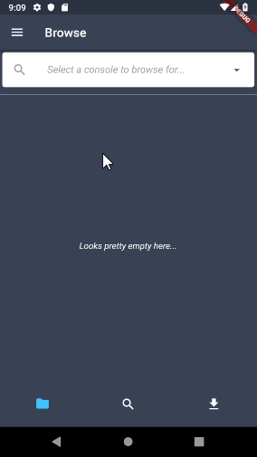

# Intro

RomBro UI is a mobile application written in Dart using Flutter which acts as a frontend for the RomBro service. It allows you to find and download your favorite ROMs. Tested to work on Android.

<p align="center">
  
</p>


# Features

  - Browse for ROMs by the console type
  - Search for ROMs by their name
  - Download ROMs found in the browse/search view
  - Execute scripts which can be created on the device where the service runs

# Configuration 
   - The endpoint for the service needs to be configured in the settings view
        - The default endpoint is set to http://retropie:5555/RomHub
  
# Todos

  - Implement a filter when browsing/searching ROMs
  - Reconnect functionality
  - Displaying notifications when errors occur
  - Tests
  - Much more I forgot
  
# Building for Android
  In the releases you can find a prebuilt apk. However you can still build it yourself if wanted.
   
```
§ cd rombro.ui
$ flutter build apk
```
  
# Credits
 Mario svg: https://icons8.com/icon/set/super-mario/office
 
 Flutter List Design: https://proandroiddev.com/flutter-thursday-02-beautiful-list-ui-and-detail-page-a9245f5ceaf0

License
----

MIT